# Image classification and generation from start to finish
---
In this repo I go through how you can use convolutional neural networks (CNN) for computer vision. I go step by step, starting from the collection of images which is done through scraping, after which I discuss image classification by training a CNN, and lastly I consider image generation with a VAE. Because doing computer vision with CNN is very quickly becomes very difficult and computationally heavy when you want to consider more complicated images than those of the MNIST database, I make use of transfer learning, which is where you take machine learning models that have already been trained by someone else to serve your own machine learning plans. Below is a description of all the contents of the folders in this repo. To make sure that you have all the necessary python packages, use pip install -r requirements.txt in the command line where equirements.txt is located. 
## Image scraping
---
In this folder I scrape the images. The images I scrape are of celebrity. To keep it simple, I focus on one celebrity. I initially wanted to scrape images of my favorite actor, Nicolas Cage. However, the number of usable images was limited. ChatGPT suggested Tom Cruise next, but many of his photos included complex backgrounds like airplanes. Finally, I settled on Julia Roberts — a choice that proved workable. Please feel free to choose your own favorite celebrity. I also scrape a second folder of images of several celebrities that are not Julia Roberts so that it can be used for binary classification. Some of the images of Julia Roberts I scraped are not great, especially when Julia Roberts is barely visible or there are many other images available. The way you can efficiently remove faulty pictures is by using an faceboxer which turns an image of a person into an image of the face only. This is an example
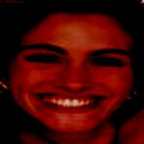
I generate all the corresponding faceboxes and then it is straightforward to identify the faulty picture by scrolling through the faces and looking for those that do not look like Julia Roberts. 
## Image Classification
---
In this folder, I classify images on the basis of whether or not they are Julia Roberts or not. For this I use transfer learning, in particular I use the mobilenet_v2 model pretrained by PyTorch. First, I show that the model I use for transferring actually does what it says, namely that it can tell a bear apart from an elephant (as well as classify 998 other things). Then, I use it to classify Julia Roberts or not. For this, I unfreeze the final layer of the transferred model, meaning that I trust that whatever was used in the other blocks of layers to recognize the 1000 things of this pretrained model will also work for recognizing Julia Roberts, which turns out to be the case mostly. I experiment with unfreezing 2 or 3 of the final layers, which does not make a big difference.

## Image Generation (VAE)
---
Lastly, I consider generation of images with VAE. VAE's were invented by Kingma and Welling in 2013, in a [paper](https://arxiv.org/abs/1312.6114). The idea is that you learn to sample a continuous p(x), i.e. you to obtain a smooth distribution of states x which are like the states in your input. The way you achieve this is by narrowing down your input to a very tiny latent space vector z which is learned to efficiently capture the nature of the input. However, this must be done in a randomized way, because otherwise you would have a simple autoencoder, which you could view as an overfitted version of the variational autoencoder in the sense that it is hyperfocused on a tiny amount of points in the latent space, thus making the latent space sparse. The way you do this is by letting the output of the encoder be the mean and variance of a distribution from which z is sampled, i.e. 
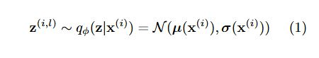
The sample in this latent space is then transformed from the latent space back to an image with the decoder as
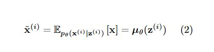
To train the VAE, you need to introduce a loss which does not only penalize if you don't reconstruct images properly but also one that makes sure that you really have a nice continuous latent space, this can be done with the loss
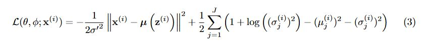
Here the first term is the reconstruction error and the second is the KL-divergence which penalizes sparsity. One more crucial insight from the paper by Kingma and Welling is that if you want to do backpropagation for a model which involves the random sampling of the encoder shown in (1), you can do the following trick
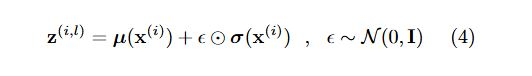
which allows for separating separating the stochastic and the learnable part of the encoder output, which enables backpropagation only for the learnable part whereas the nonlearnable part is left untouched.

A VAE such as the one described above works great in theory, as well as when you try it for the MNIST database, but if you want to do serious things like image generation it turns out that you won't get far if you just construct some CNN of a couple of layers, it will likely not be able to grasp the complex nature of faces. See this example of when I tried to do this with just the loss function of (2):

So, instead I again rely things done by others before me that worked well. In particular, there is [this amazing repo](https://github.com/LukeDitria/CNN-VAE/tree/master) where the ideas on perceptual loss expressed in [this work](https://arxiv.org/abs/1610.00291) work are put to practice. The basic idea of perceptual loss is that instead of working with the simple loss of (2), you put your decoder output through different pretrained CNN (VGG) which is trained to recognize faces, so that the loss which is extracted at several layers in this CNN can guide the VAE in a much better direction when it tries to accurately reconstruct faces (the pretrained CNN used in the loss is not trained). Here is a gif of output that I generated with the VAE trained on the CelebA dataset that shows it has learned the continuum of celebrities' faces. 
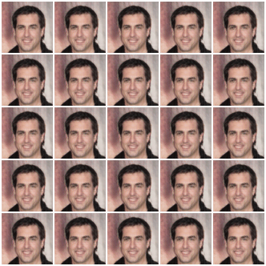.
Training one epoch of this takes 17 hours on humble laptop and I did 10, after which I no longer saw improvement. Now the question is how to put this to use for our ultimate goal which is sampling images of Julia Roberts. The first thing I tried was to use transfer learning in a way that is similar to what we saw before: I take the trained model, unfreeze some of the last layers of the decoder, and train it on my own set of Julia Roberts images. This however lead to very bad results: 
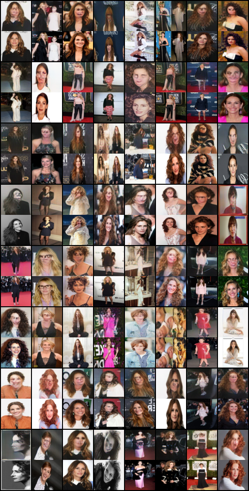

I guess the lesson learned is that the CelebA set is very constrained in the way it displays celebrities' faces and even with this dataset it takes many fortnights to get something reasonable, so that the model that is eventually trained is simply too rigid to adapt to images of a more diverse kind. Instead, I now simplify and hold on to what works. In particular, I try to look for images of Julia Roberts in the CelebA dataset and look for the value of the corresponding vector in latent space. We can then try to move around in this vector space in such a way that we leave the facial characteristics invariant to still get a continuum of different Julia Roberts'. But the CelebA dataset has 200K images (!), so how do we find images of Julia Roberts in the CelebA dataset? We use our binary classifier! I ran all the images in CelebA through the model which is trained to have only the final two blocks unfrozen and selected positives with a threshold for the model output of 0.995 and still got 56 images. Out of these images, I managed to find 1 image that is of Julia Roberts:
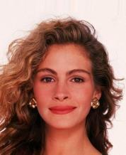

Now the CelebA dataset is anonomized but still provides labels, and the obtained label was 4990, so with that I could find all the other Julia Roberts images, except for one other which I obtained in a different attempt

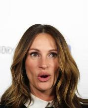

This Julia Roberts image somehow has label 4979. Based on this it seems that there are 22 Julia Roberts in the full dataset, which means that the model changed a set of 200K images with 22 positives (0.011%) to a set of 56 images with 1 positive (1.78%), which is not bad considering that the classifier only used 800 positives and 800 negatives to train. Now that we have these images we know a lot about the latent representation of Julia Roberts in the model. If we try to make a morphing gif like we did before but now only of Julia Roberts images, we obtain:

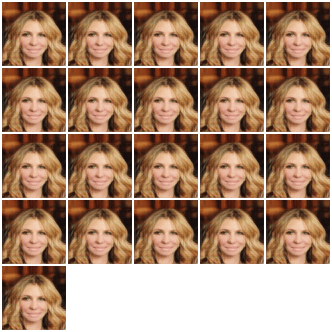

This looks quite bad! It seems to be the case that the model somehow did very poorly at learning to reconstruct Julia Roberts. In the notebook in the VAE folder 
I make an attempt to improve this. In particular, I simply proceed training the VAE but now exclusively on the Julia Roberts images. I also take the KL divergence loss to lowered by factor 0.02 lower because I am only interested in reconstruction, the training set is far too small to hope for a nice smooth distribution of images. This means we are on purpose overfitting our VAE and effectively turning the VAE into an AE. That is the price we have to pay for getting something that looks somewhat decent. The result is below. 

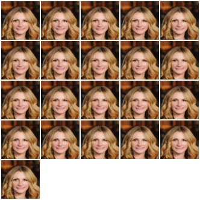

For some reason, it has an extremely hard time making the open lip smile work for these reconstructions of Julia Roberts, which is strange because around half of the Julia Roberts images have such a smile and for the gif for the general celebA dataset it seemed that the model was able to produce open lip smiles.

What this attempt taught me is that it seems that whereas classifying with CNN's is something that can quite quickly lead to good results, getting a VAE to give good results for very general faces is tough. Perhaps things would have been better if I had managed to find some pretrained VAE somewhere which I could have subjected to transfer learning the same way I did with classification, because my computing power is limited. To get a VAE that works really well, I could choose to convert my dataset of scraped Julia Roberts images into something that is more uniform by centering the faces. Perhaps then a real good image generator could be be trained. Alternatively, I can look into generative adversial networks (GAN) as it is known that this is the technology like is used for creating faces of [people that don't exist](https://thispersondoesnotexist.com/). 
